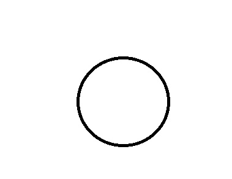
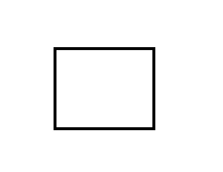
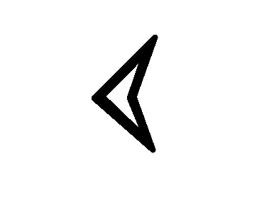
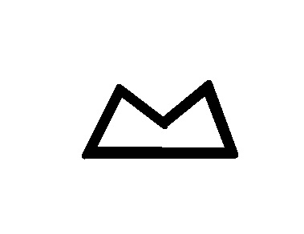
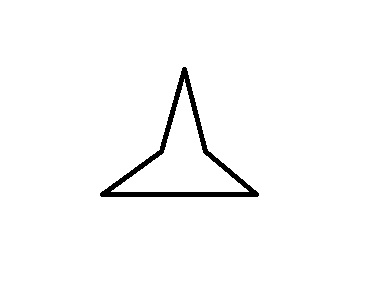

# Smart Wake-Up System: Proyecto Final de Visión por Ordenador I

> **Institución:** Universidad Pontificia Comillas (ICAI) - Ingeniería Matemática 
> **Asignatura:** Visión por Ordenador I 
> **Curso:** 2025/2026

## Autores
- Juan García Moraga
- Javier Andrés Bernárdez

## Descripción del Proyecto

Este proyecto implementa un **sistema de despertar inteligente** basado en visión por ordenador. A diferencia de las alarmas tradicionales, este sistema monitoriza al usuario mientras duerme mediante una cámara y utiliza un tracker para verificar si se ha levantado.

Para garantizar que el usuario está completamente despierto y cognitivamente activo, el sistema integra un **módulo de seguridad** que impide desactivar la alarma hasta que se muestra a la cámara una secuencia específica de patrones visuales.

### Funcionalidades Principales
1.  **Monitorización del sueño:** Uso de *tracking* para detectar la presencia o movimiento del usuario en la cama.
2.  **Validación de despertar:** La alarma persiste hasta que se cumple la condición de desbloqueo.
3.  **Desbloqueo por Patrones:** Decodificación de una secuencia visual (figuras geométricas básicas) para desactivar el sistema (Requisito de Seguridad).

---

## Arquitectura del Sistema

El flujo de trabajo se divide en los siguientes bloques:

1.  **Calibración (Offline):**
    * Cálculo de la matriz intrínseca de la cámara y coeficientes de distorsión para corregir la entrada de vídeo.
    
2.  **Sistema Propuesto (Vigilancia):**
    * **Tracker:** Se inicializa una *Bounding Box* sobre el usuario. Si el tracker detecta movimiento significativo o la ausencia del usuario (al levantarse), se activa el estado de "Alerta/Validación".
    
3.  **Sistema de Seguridad (Desactivación):**
    * **Detector de Patrones:** Reconocimiento de formas geométricas básicas.
    * **Decodificador de Secuencia:** Lógica de estados que valida una secuencia ordenada (ej. Círculo -> Círculo -> Línea -> Línea). Solo al completar la secuencia correcta se apaga la alarma.

## Requisitos de Hardware
- Cámara web o cámara IP con buena resolución. (Recomendable móvil android con aplicación [IP Webcam](https://play.google.com/store/apps/details?id=com.pas.webcam&hl=es))
- Ordenador con buena conexión a internet.
- Soporte para la cámara (trípode, soporte móvil, etc.)

---
## Instrucciones de Uso
1. Clonar el repositorio.
2. Calcular los parámetros de la cámara ejecutando `calibracion.py`.
3. Cargar en main.py los parámetros de la cámara
4. Copiar el link de la cámara IP en `main.py`.
5. Elegir la secuencia de patrones en `main.py` cambiando la variable global `EXPECTED_SEQUENCE`.
6. Ejecutar `main.py` para iniciar el sistema.

---
## Figuras que el sistema puede detectar
- Círculo

- Cuadrado

- Flecha

- Montaña

- Pico

